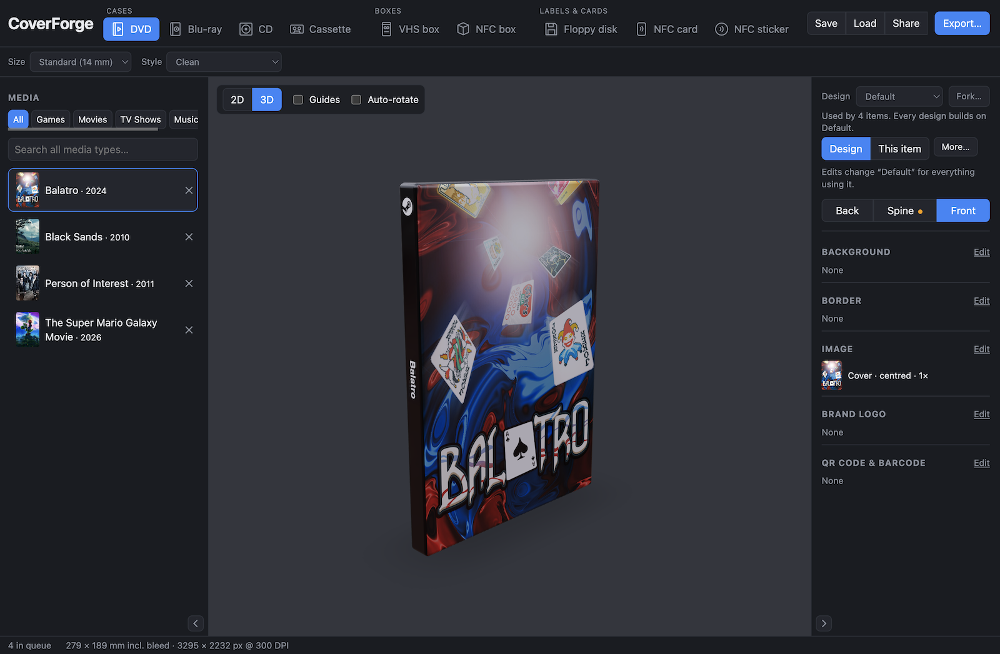

# CoverForge

Client-side cover art generator for physical media collectors: build a queue of games, TV, movies and music (or your own artwork), pick a physical template, style it, preview it in 3D and export print-ready sheets.



## Features

- **Media sources:** Steam games, TV (TVMaze), music (MusicBrainz + Cover Art Archive), movies (TMDB or a free [OMDb](https://www.omdbapi.com/apikey.aspx) key — both are callable straight from the browser, no relay to deploy; see below) and **custom** entries with your own images. Each item gets a normalised image library (cover, hero/back, logo, extra images) you can assign to any panel.
- **Templates:** Blu-ray, DVD, CD and cassette cases; VHS box; NFC box (slim card box, small box, or a spineless card wallet with a slip cover); 3.5" floppy label; NFC card (front only, or front + back) and round NFC stickers (25, 30 or 35 mm). Templates are one-click tabs with an icon each. Each has its real panel layout, bleed, and fold and cut lines, and every item in the queue follows the chosen template. Boxes are printable nets: the strip folds into a tube with one glue tab (double-sided tape works), the lid and bottom each have a tuck flap that slots in, so the ends close without glue, and dust flaps on the sides close the corners. The cassette's Back design is a flap that wraps round the spine onto the back of the case, as a partial back image.
- **Editor:** per-panel background, an accent border (colour, width and inset from the trim edge), image, position (from the panel's top-left, centred by default), size, rotation and opacity; brand logos for stores and consoles; QR codes and EAN-13 / UPC-A / Code 128 barcodes; spine text (sized automatically so a long title of about 45 characters fits on one line; override it with the Text height slider, and rotate it, e.g. 180° to read bottom-to-top). Styling lives in **designs**: the built-in *Default* design applies to every item, and you can *Fork* it (or any design) into a named design that only stores what you change, used by the selected item. Each part of a design (background, image, logo, code, spine text) shows a read-only summary until you press *Edit* on it. Edits go to the item's design, so everything using it follows; *This item* edits just that item on top of its design. Designs work on every template.
- **Styles:** *Clean*, *Digital / Official* (header banners and spine caps that name only the medium: BLU-RAY, DVD, VHS, COMPACT DISC, TAPE, FLOPPY, NFC, so they suit any content) and *Scanned / Retro wear* (procedural plastic glare, creases, scuffs and grain).
- **3D preview:** rotate and zoom a model of the case, box, card or disk with your artwork mapped on.
- **Export:** 300 DPI PNG/JPEG, PDF or SVG at exact millimetres with vector cut/fold guides, multi-up sheets on A4/Letter, die-cut **Avery** label sheets, and a "Download all" ZIP with each item's flat render, original images and print sheets.
- **Layout:** both side panels can be drag-resized from their inner edge (double-click it to reset) or collapsed to a slim rail; sizes are remembered per browser.
- **Session:** your queue and settings are saved in the browser and restored on return (`localStorage`, as a versioned JSON document).
- **Save, load and share:** *Save* writes the whole configuration to a `.coverforge.json` file (a native "Save as" dialog in Chrome and Edge, a normal download elsewhere) (uploaded images are embedded, so it works on another machine) and *Load* opens one. *Share* copies a link that reopens the same configuration; when it's only Steam games with default styling it's a readable link like the one below, otherwise a packed `?c=` link. Uploaded images can't travel in a link, so those slots come back empty; use *Save* for them. Links can also be written by hand: `?template=dvd&variant=slim-9&region=EU&style=retro&view=3d&app=1091500` opens that template and adds Steam game 1091500 to the queue (several ids may be comma-separated).

## Develop

```sh
npm install
npm run dev          # local dev server (Steam search works out of the box via a Vite proxy)
npm run type-check
npm run lint
npm test             # Vitest unit tests
npm run build
npm run gen:brands   # regenerate src/brands/brands.generated.ts from Simple Icons
```

## Deploy (GitHub Pages)

`.github/workflows/deploy.yml` type-checks, lints, tests and builds on every push to `main`, then publishes `dist/` to GitHub Pages. One-time setup:

1. **Settings → Pages → Source: GitHub Actions.**
2. *(Optional)* **Settings → Secrets and variables → Actions → Variables:**
   - `VITE_STEAM_PROXY_URL`: the CORS relay for Steam search. Defaults to the public `https://corx.venipa.workers.dev`, a third-party Worker that works today but comes with no guarantees and sees your users' search terms. A URL ending in `/` is used as a cors-anywhere-style prefix instead (`<prefix><target-url>`). Steam's API needs no key at all, so this variable is a plain CORS pass-through — nothing secret sits behind it.
   - `VITE_TMDB_API_KEY`: a free TMDB "API Read Access Token", baked into the build so every visitor gets TMDB's richer art (separate poster, backdrop and logo) with nothing to set up on their end. Get one at [themoviedb.org/settings/api](https://www.themoviedb.org/settings/api).
   - `VITE_OMDB_API_KEY`: the same idea for [OMDb](https://www.omdbapi.com/apikey.aspx), used only when no TMDB token is configured (or a visitor has switched to their own OMDb key). One poster only, no separate backdrop or logo.
   - `VITE_TMDB_PROXY_URL`: only needed if you'd rather hide your TMDB token behind a server than ship it in the client bundle — see below.

The build uses relative asset paths (`base: './'`), so it works under `https://<user>.github.io/<repo>/`.

### Movies and Steam: keys, and whether you need a relay

It's easy to assume Movies and Steam work differently because one is set with a key and the other with a URL — they don't; **every** provider here except Steam needs a key, TMDB included. The two things that actually vary are:

- **Does the API need a key at all?** Steam's Store API needs none. TMDB and OMDb both do — there's no free, key-less movie catalogue.
- **Does the API send CORS headers, so a browser can call it directly?** Steam's doesn't, so it always needs a relay. TMDB and OMDb both do (confirmed by hand), so **neither needs a relay** — a key alone, used straight from the browser, is enough for either.

So the simplest working setup for Movies is just `VITE_TMDB_API_KEY` or `VITE_OMDB_API_KEY`, no server involved, exactly like a Steam-proxy-style shared key: it ships inside the client bundle (visible to anyone who looks, not a secret) and its quota is shared by everyone who uses your deployment.

**Hiding the key behind a relay instead** is only worth doing if you don't want the token visible in your bundle. [`worker/steam-proxy.js`](worker/steam-proxy.js) is a small Cloudflare Worker that relays `store.steampowered.com/api/*` (Steam, which needs this regardless) and, optionally, `api.themoviedb.org/3/*` with your TMDB token kept as a server-side secret:

```sh
npx wrangler deploy worker/steam-proxy.js --name coverforge-relay --compatibility-date 2025-01-01
npx wrangler secret put TMDB_TOKEN --name coverforge-relay     # optional: your TMDB "API Read Access Token"
```

Set `VITE_STEAM_PROXY_URL` to `https://coverforge-relay.<you>.workers.dev`; add `VITE_TMDB_PROXY_URL` set to the same URL only if you'd rather route TMDB through it than use `VITE_TMDB_API_KEY` directly. A visitor's own personal TMDB key (below) always bypasses this relay regardless — it's their key, their quota.

**Choosing between a visitor's own key and yours:** the Movies tab lets a visitor paste in their own key — TMDB (richer art) offered first, with a link to switch to OMDb — kept only in their browser (`localStorage`), never bundled or sent anywhere but the chosen provider's API, and using their own quota instead of sharing yours. It asks for one when nothing else is configured, and offers it as an opt-in "use your own key" link when a shared key is already working. Precedence, most specific first: a personal TMDB key > a personal OMDb key (which also opts out of any shared/relay TMDB token) > a shared/relay TMDB token > a shared OMDb key > nothing. (Both movie providers are unit-tested against their documented response shapes but have not been run end-to-end against the live APIs.)

## How it works

- **Rendering:** `src/engine/CanvasRenderer.ts` exposes a pure `renderCover()` used by the editor, the 3D texture and every export. Settings resolve field by field: built-in default → Default design → the item's design → item override (`src/engine/resolve.ts`, `src/engine/designs.ts`).
- **Templates:** `src/templates/` builds each dieline from panel rectangles; bleed and fold/cut lines are derived from which panels touch (`geometry.ts`), so horizontal wraps, vertical strips, separate pieces and box nets all work.
- **3D:** `src/three/` builds a rounded box or card/disk from each template's preview spec and maps the flat artwork onto it.
- **Sheets:** `src/export/imposition.ts` packs items on plain paper; `src/export/sheets.ts` places them on die-cut Avery sheets, centred on each label and cropped to it.
- **Codes:** QR codes are drawn from the module matrix and barcodes from standard encoders, so they scan (verified by decoding rendered output). A code that doesn't fit inside its panel's safe area is omitted. The QR default is `steam://run/{appId}`, which launches the game in the Steam app. Barcodes print real EAN-13/UPC-A digits if you type them (the check digit is verified); without digits a number from the reserved in-store range is generated, because there is no free title-to-barcode lookup.
- **Dimensions:** Blu-ray panels are 128 × 148 mm (spine 11 / 12.5 / 14 mm), DVD 129.5 × 183 mm (spine 14 mm, or 9 mm slim), VHS box 105 × 190 × 25 mm (portrait, spine on the long side), cassette J-card 65.1 + 12.7 + 25.4 × 101.6 mm, CD booklet 120 × 120 mm with a 137 mm tray card. These follow the figures published by cover-template suppliers ([printdvdcover.com](https://www.printdvdcover.com/blu-ray-elite-case-cover-layout.php), [CoverStitch](https://coverstitch.io/dimensions.html), a duplicator's [Blu-ray trapsheet spec](https://www.duplication.com/printspecs/blu-ray.php)); suppliers differ by 1–2 mm, so measure your own insert if it has to be exact. Bleed is 3 mm for cases and 1 mm for labels and cards.
- **3D:** cards, stickers and disks are extruded from their real outline (CR80 corners are 3.18 mm; a sticker is a circle; a floppy has the cut corner, shutter with window and drive hub), with the artwork following that outline.
- **Uploads:** custom images are stored untouched in the browser's IndexedDB (a browser can't keep a path to your file), so nothing is scaled. They live in that browser only and aren't part of a saved session's JSON.
- **Links:** `src/context/share.ts` packs the session JSON with deflate and URL-safe base64 into `?c=…` (about 1.4 KB for one game). The address bar is cleaned after it is read, so later edits and reloads aren't overridden. Over about 6,000 characters the app suggests *Save* instead.
- **Sources:** `src/api/providers/` gives every catalogue the same `search()` / `createItem()` shape.

### Sheet geometry: what is verified

Avery **5371** (business cards) and **5395** (name badges) use published sizes and margins that add up exactly to the page. **5196** (3.5" diskette labels) has published size, count and margins, but its vertical spacing is assumed, and the app says so. Print one page on plain paper and hold it against a real sheet before using labels.

### Trademarks and third-party data

Store and console marks come from [Simple Icons](https://simpleicons.org) (CC0 artwork; the brands remain trademarks of their owners), baked into `src/brands/brands.generated.ts`. Xbox and Nintendo marks aren't available from that source and aren't included. Artwork comes from each provider's public API or CDN and belongs to its owners. See [THIRD_PARTY_NOTICES.md](THIRD_PARTY_NOTICES.md).

## Not built yet

Non-Steam game catalogues.
